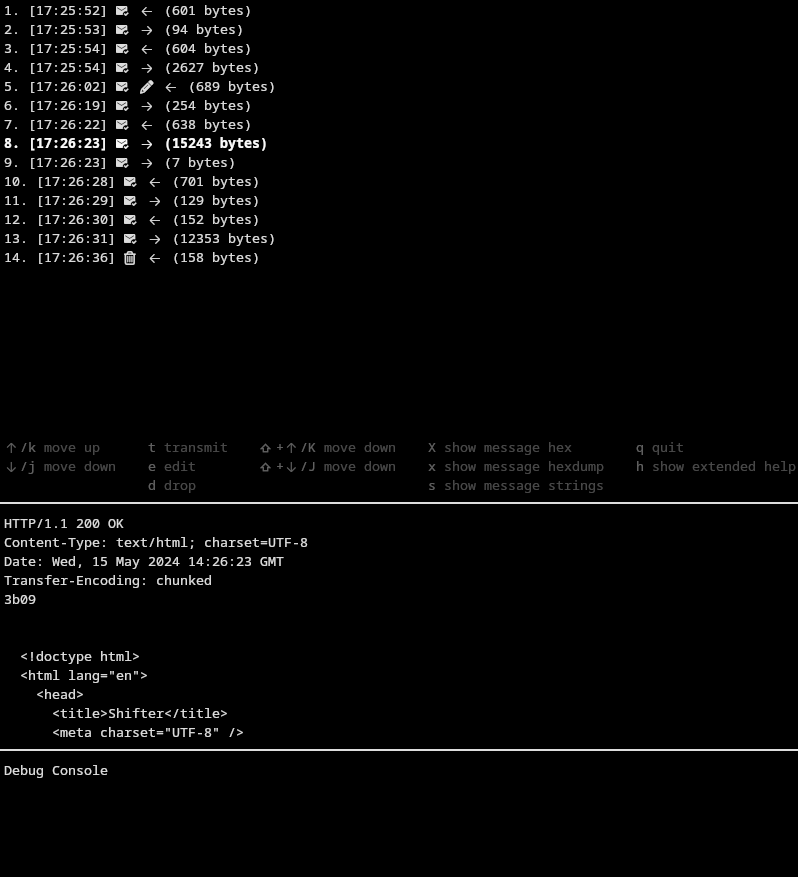

# Protocol Proxy
Manually controlled proxy for exploring/debugging TCP protocols

## Usage
```
Usage of protocol-proxy:
  -in-port int
        The in port on which to listen
  -out-ip string
        The out ip to which to output (default "127.0.0.1")
  -out-port int
        The out port to which to output
```

For example run
```
./protocol-proxy -in-port 1337 -out-port 8080
```
With a server listening on the out-port (for example `nc -l 8080`).

Now connect to the in-port (for example `nc localhost 1337`).


Of course the server and the client can be any source, for example you could
use iptables to route any type of tcp traffic through the protocol proxy.



## Building and running
Clone the project, `go build`, and run the `protocol-proxy` executable

## Contributing
Any help is appreciated!

Contribute by creating an Issue/a Pull Request
